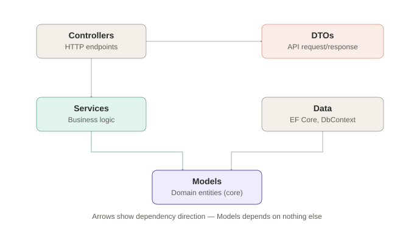

## Architecture

Follows a lightweight Clean Architecture structure — Controllers and Data are outer, infrastructure-facing layers; Services holds business logic; Models is the core domain layer with no outward dependencies.





## Project structure

```
ClaimPortal.Api/
  Controllers/   # HTTP endpoints, thin — delegate to Services
  Services/      # Business logic (e.g. ClaimService)
  Models/        # Domain entities (Claim, Claimant, ClaimStatus)
  DTOs/          # Request/response shapes for the API boundary
  Data/          # EF Core DbContext
```

## Endpoints (current)

| Method | Route | Description |
|---|---|---|
| POST | `/api/claims` | Submit a new claim |
| GET | `/api/claims` | List all claims |
| GET | `/api/claims/{id}` | Get a single claim |
| PATCH | `/api/claims/{id}/status` | Update a claim's status |

## Local setup

1. Requires SQL Server Express (or update the connection string in `appsettings.json` / user-secrets)
2. Restore packages: `dotnet restore`
3. Apply migrations: `dotnet ef database update`
4. Run: `dotnet run`
5. API docs (dev only): `https://localhost:{port}/openapi/v1.json`
