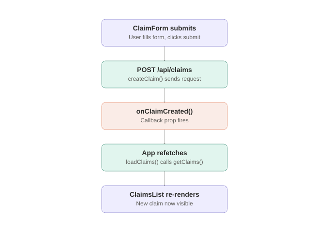

# ClaimPortal — Client

React + TypeScript + Vite frontend for ClaimPortal, a mini Class Action claims administration system. Talks to the [ClaimPortal.Api](../ClaimPortal.Api) backend.

## Architecture

Components are split by responsibility: `App` owns the shared claims state and data-fetching, `ClaimsList`/`ClaimCard` handle display, and `ClaimForm` handles submission — communicating back to the parent via a callback prop after a successful create.



## Project structure

```
client/
  src/
    components/   # ClaimCard, ClaimsList, ClaimForm
    hooks/         # Custom hooks (reserved for future use)
    types/         # TS interfaces mirroring the API's DTOs (Claim, CreateClaimRequest, ClaimStatus)
    api/           # Functions calling the backend (getClaims, createClaim)
    App.tsx        # Owns claims state, wires form + list together
  vite.config.ts    # Dev server + proxy config
```

## Types ↔ API DTOs

| TS type | Mirrors (C#) |
|---|---|
| `Claim` | `Models/Claim.cs` |
| `CreateClaimRequest` | `DTOs/CreateClaimRequest.cs` |
| `ClaimStatus` | `Models/ClaimStatus.cs` (enum, serialized as string) |

## Local setup

1. Requires the [ClaimPortal.Api](../ClaimPortal.Api) backend running (default: `http://localhost:5111`)
2. Install dependencies: `npm install`
3. Run dev server: `npm run dev`
4. Open the printed local URL (default: `http://localhost:5173`)

API calls are proxied — requests to `/api/*` are forwarded to the backend automatically, see `vite.config.ts`.

## Status

- [x] Vite + React + TypeScript scaffold
- [x] TypeScript types matching backend DTOs
- [x] Claim list + claim submission form, live data
- [ ] Form validation
- [ ] Status-update UI (admin actions)
- [ ] Entra ID authentication
- [ ] Accessibility (WCAG) pass
